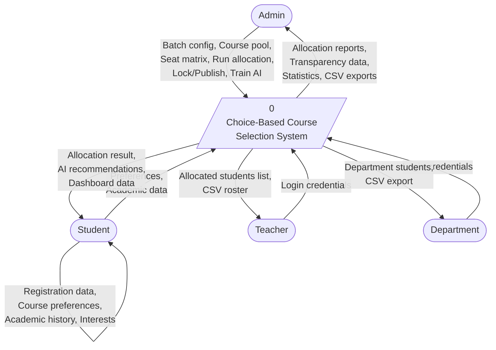
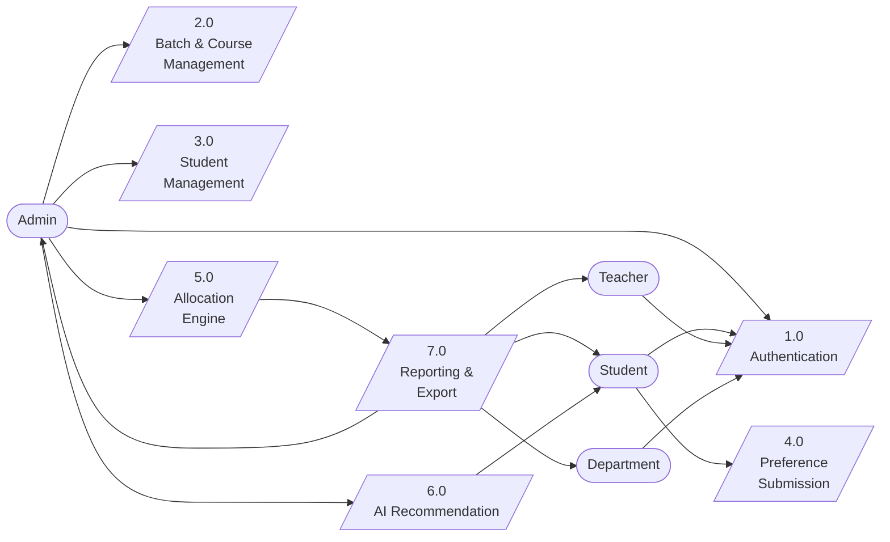
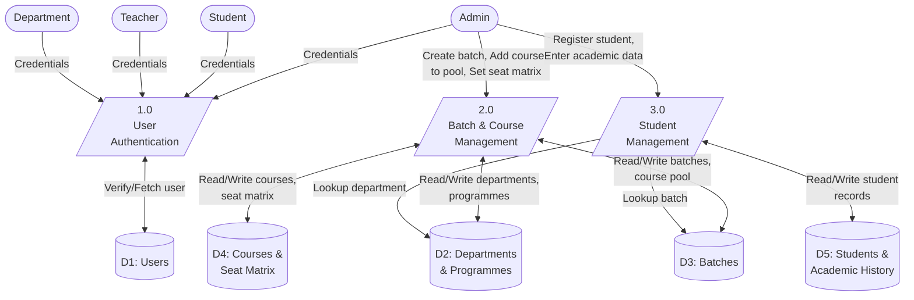
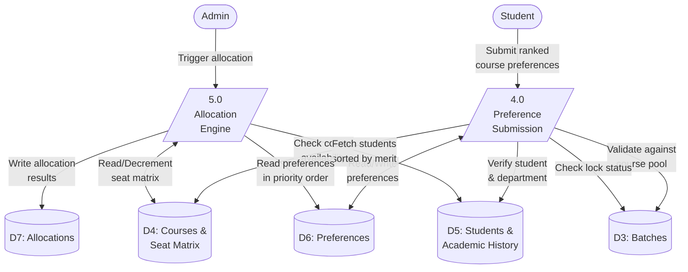
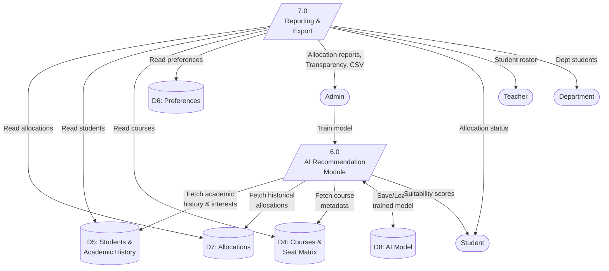
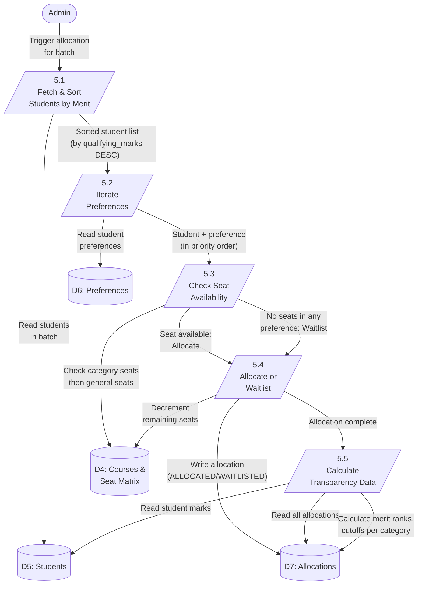
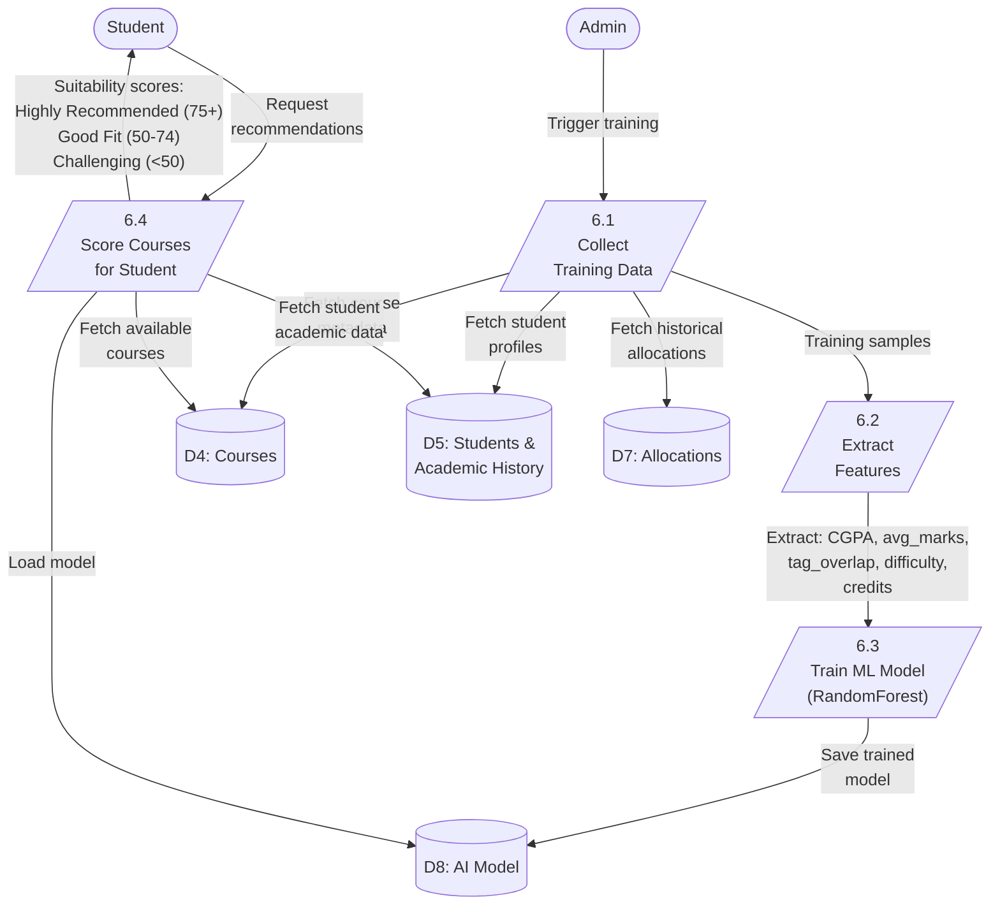

# Data Flow Diagrams — Choice-Based Course Selection System

---

## Level 0: Context Diagram

---

## Level 1: Overview

---

## Level 1a: Authentication & Setup (Processes 1.0 – 3.0)

---

## Level 1b: Preference & Allocation (Processes 4.0 – 5.0)

---

## Level 1c: AI Recommendation & Reporting (Processes 6.0 – 7.0)

---

## Level 2: Allocation Engine (Process 5.0)

---

## Level 2: AI Recommendation Module (Process 6.0)

---

## Data Store Descriptions

| Store | Contents | Source Tables |
|-------|----------|---------------|
| D1: Users | Login credentials, roles (Admin/Student/Teacher/Department) | `user` |
| D2: Departments & Programmes | 20 departments, 40+ programmes, academic structure | `department`, `programme` |
| D3: Batches | Student cohorts, semester info, lock/publish flags, course pool | `batch`, `course_pool` |
| D4: Courses & Seat Matrix | Course offerings, category-wise seat allocation | `course`, `seat_matrix` |
| D5: Students & Academic History | Student profiles, marks, CGPA, interests | `student`, `student_academic_history`, `student_subject_mark`, `student_interest` |
| D6: Preferences | Ranked course preferences per student | `preference` |
| D7: Allocations | Final allocation results with status | `allocation` |
| D8: AI Model | Trained RandomForestRegressor model file | `ai_model/` directory |
